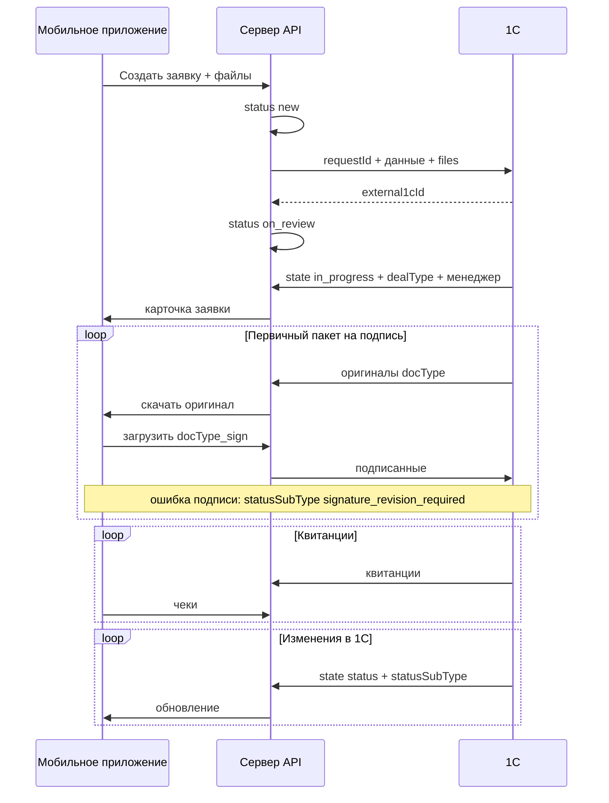

# Техническое задание: обработка заявки «Импорт Сервис» (МП ↔ Сервер ↔ 1С)

**Версия черновика:** 1.0  
**Источник:** «Обработка заявки Импортсервис с МП.docx»  
**Область:** интеграция мобильного приложения, серверной части и 1С по таможенным заявкам. Текущая реализация кода **не является** ограничением — ТЗ задаёт целевую модель.

---

## 1. Цель

Описать единый цикл работы с заявкой на таможенное оформление:

- клиент создаёт заявку и загружает документы в **мобильном приложении (МП)**;
- **сервер** хранит данные, выдаёт API приложению и обменивается с **1С**;
- **менеджеры** ведут заявку в **1С** (статусы, документы, суммы, менеджер);
- клиент получает документы на подпись, квитанции на оплату, архив фото/видео и итоговые документы после таможни — всё через МП.

Отдельно (вне этого ТЗ, но уже согласовано): синхронизация **данных пользователя/организации** из 1С в МП — **готово**, в данном документе не детализируется.

---

## 2. Участники и зоны ответственности

| Участник | Роль |
|----------|------|
| **МП** | UI клиента: создание заявки, просмотр статуса, скачивание/загрузка файлов, оплата (чеки), чат с менеджером (если включён в релиз). |
| **Сервер (API)** | Единая точка входа для МП; хранение заявок и файлов; оркестрация обмена с 1С; права доступа; журналирование. |
| **1С** | Учётная система: создание и ведение заявки, назначение менеджера, комплекты документов по виду сделки, квитанции, финальные документы. |
| **Менеджер** | Работает в 1С; клиент взаимодействует через МП. |

**Принцип:** МП **не обращается** к 1С напрямую. 1С **не обращается** к МП. Все интеграционные вызовы — **Сервер ↔ 1С**, пользовательский трафик — **МП ↔ Сервер**.

---

## 3. Идентификаторы

| Идентификатор | Владелец | Назначение |
|---------------|----------|------------|
| `requestId` | Сервер | Внутренний числовой (или строковый) id заявки после создания в МП. Передаётся в 1С при создании заявки. |
| `external1cId` | 1С | Внешний id заявки в 1С (GUID/код). Возвращается при успешном создании заявки в 1С. Далее — ключ для всех обновлений из 1С. |
| `managerExternal1cId` | 1С | Id менеджера в 1С. |
| `docType` | Контракт | Стабильный код типа файла/документа (см. раздел 7). |
| `message1cId` | 1С | Id сообщения чата (если чат в scope релиза). |

После привязки заявки любые изменения со стороны 1С идут **только по `external1cId`**.

---

## 4. Общая схема обмена



---

## 5. Жизненный цикл заявки (бизнес-этапы)

Ниже — логические этапы по документу. Конкретные коды `status` / `subStatus` для API и отображения в МП **фиксируются в разделе 6** (требует согласования с 1С).

| № | Этап | Кто инициирует | Суть |
|---|------|----------------|------|
| 1 | Создание заявки | МП → Сервер → 1С | Клиент заполняет форму и прикрепляет обязательные файлы (как на import-service.su). |
| 2 | Обработка в 1С | 1С | Назначение менеджера, смена статусов, суммы аванса и фактической оплаты. |
| 3 | Первичный пакет документов | 1С → МП | Менеджер формирует комплект по **виду сделки**; клиент подписывает и возвращает. |
| 4 | Оплата утилизационного сбора | 1С ↔ МП | Квитанция от 1С; клиент загружает чек; не обязательно ждать подписания всего пакета из п.3. |
| 5 | Оплата госпошлины | 1С ↔ МП | Квитанция при физическом транзите; клиент загружает чек; может прийти до возврата всех подписанных копий из п.3. |
| 6 | Архив перед транзитом | 1С → МП | Фото/видео состояния авто (только скачивание). |
| 7 | Завершение | 1С → МП | Итоговые документы (ЭПТС, СБКТС и др.) — только выдача клиенту. |

**Важно:** этапы **4 и 5** по смыслу документа **параллельны** этапу 3 (не строгая цепочка «сначала всё подписали — потом квитанции»).

---

## 6. Статусы и подстатусы (целевая модель)

### 6.1. Статусы верхнего уровня (для МП)

Базовый справочник статусов (с учётом уточнений по нестабильному каналу 1С):

| Код (пример) | Отображение в МП | Когда используется |
|--------------|------------------|--------------------|
| `new` | Новая | Заявка создана на сервере, но 1С ещё не ответила по созданию (`external1cId` не получен). |
| `on_review` | На рассмотрении | Ответ от 1С получен (`external1cId` есть), но менеджер ещё не назначен. |
| `in_progress` | В работе | В заявке появился менеджер, идёт основная обработка и документооборот. |
| `in_transit` | В пути | Этапы транзита/СВХ и связанные операции. |
| `delivered` | Доставлено | Этапы после прибытия, оформление, выдача клиенту/закрытие. |
| `closed` | Закрыта | Финальное закрытие заявки (если в 1С ведётся отдельно от «доставлено»). |
| `cancelled` | Отменена | При необходимости бизнес-процесса. |

`awaiting_client` как верхнеуровневый статус не используется; это поведение фиксируется через подстатусы и UI-подсказки.

### 6.2. Подстатусы (`subStatus`)

Подстатусы приходят из 1С и используются:

- для внутренней детализации этапа;
- для текстовых подсказок клиенту (например, «подпишите документы», «загрузите чек»);
- для подсветки незавершённых действий в МП.

Поле **`subStatusDateTime`** — дата/время, связанная с подстатусом (для таймлайна карточки заявки).

### 6.3. Справочник подстатусов (по данным 1С)

1С оперирует подстатусами из настройки (группы: **На проверке**, **В работе**, **В пути**, **Доставлено**). В API передаётся поле **`statusSubType`** — машинный код из таблицы ниже (полный справочник: `docs/catalog-reference.md`).

**На проверке** (`status` → `on_review`):

| Код | Название в 1С |
|-----|----------------|
| `draft` | Черновик |

**В работе** (`in_progress`):

| Код | Название в 1С |
|-----|----------------|
| `manager_execution` | На исполнении у менеджера |
| `primary_documents_sent` | Отправлены первичные документы |
| `originals_partial_no_transit` | Получены оригиналы (не все документы), нет транзита |
| `originals_complete_no_transit` | Получены оригиналы (все документы), нет транзита |
| `signature_revision_required` | Требуется переподпись (доп. код для возврата подписи) |

**В пути** (`in_transit`):

| Код | Название в 1С |
|-----|----------------|
| `originals_missing_transit` | Оригиналы отсутствуют, есть транзит |
| `originals_partial_transit` | Получены оригиналы (не все документы), есть транзит |
| `originals_complete_transit` | Получены оригиналы (все документы), есть транзит |

**Доставлено** (`delivered` / `closed`):

| Код | Название в 1С |
|-----|----------------|
| `svh_no_originals_no_recycling` | Авто на СВХ, оригиналы отсутствуют, нет утиля |
| `svh_partial_docs_no_recycling` | Авто на СВХ, не все документы, нет утиля |
| `svh_no_originals_recycling` | Авто на СВХ, оригиналы отсутствуют, есть утиль |
| `svh_partial_docs_recycling` | Авто на СВХ, не все документы, есть утиль |
| `svh_all_docs_no_recycling` | Авто на СВХ, все документы, нет утиля |
| `svh_all_docs_recycling` | Авто на СВХ, все документы, есть утиль |
| `ptd_submitted` | Подана ПТД |
| `ptd_submitted_paid` | Подана ПТД с оплатой |
| `ptd_release` | Выпуск ПТД |
| `sent_to_lab` | Направлено в лабораторию |
| `issued_to_client` | Выдано клиенту |
| `request_closed` | Заявка закрыта → верхний статус `closed` |

### 6.4. Правила переходов статусов

1. После `POST /requests` заявка всегда создаётся как `new`.  
2. Пока 1С не вернула ответ по созданию заявки, статус остаётся `new`.  
3. После успешного ответа 1С и получения `external1cId` заявка переходит в `on_review` («На рассмотрении»).  
4. После первого апдейта из 1С, где заполнен менеджер (`managerExternal1cId`), заявка переходит в `in_progress` («В работе»).  
5. Далее переходы определяются подстатусами 1С из группы «В пути» и «Доставлено».  
6. `Заявка закрыта` в 1С маппится на `closed` (или на `delivered`, если решено оставить один финальный статус в UI).

---

## 7. Вид сделки и первичные документы

### 7.1. Вид сделки (`dealType`, enum)

Задаётся **менеджером в 1С** при переводе заявки в **«В работе»** (`in_progress`) через `POST /api/integration/customs-requests/state` и **не меняется** до завершения заявки.

| Код API | Название |
|---------|----------|
| `bilateral` | Двухсторонняя сделка |
| `cash` | Наличный расчёт |
| `tripartite` | Трёхсторонняя сделка |
| `quadripartite` | Четырёхсторонняя сделка |

Сервер сохраняет `dealType` и отдаёт в МП **для информации** (без редактирования клиентом).

### 7.2. Комплект первичных документов (1С → МП, затем подпись МП → 1С)

Состав зависит от вида сделки. Менеджер **прикрепляет** документы в 1С; сервер доставляет ссылки/файлы в МП.

**Важно про контракт:** в этой таблице `contract` — **контракт пакета на подпись** (оригинал от менеджера, 1С → upload). Это **не** контракт экспортёра при создании заявки — тот имеет отдельный код **`contract_original`** (см. §7.3). В одной заявке могут сосуществовать оба файла с разными `docType`.

**Двухсторонняя сделка:**

| docType (предлагаемый код) | Наименование |
|----------------------------|--------------|
| `recycling_fee_calc` | Расчёт утилизационного сбора |
| `kuts` | КУТС |
| `explanatory_note` | Пояснение |
| `customs_rep_agreement` | Договор таможенного представителя |
| `funds_transfer_application` | Заявление на перевод остатков средств (после растаможивания) |
| `passport_notarized_copy` | Паспорт (нотариальная копия) |
| `contract` | Контракт (пакет на подпись, от менеджера) |

**Наличный расчёт:** как двухсторонняя, но **без** `funds_transfer_application`; дополнительно:

| docType | Наименование |
|---------|--------------|
| `receipt` | Расписка |
| `additional_agreement` | Дополнительное соглашение |

**Трехсторонняя:** к набору двухсторонней добавляется `tripartite_agreement` (Трёхсторонний договор).  
**Четырёхсторонняя:** добавляется `quadripartite_agreement` (Четырёхсторонний договор).

### 7.3. Документы при создании заявки (МП → 1С)

Идентификаторы файлов при **первичной отправке** заявки (как в документе):

`passport_front`, `passport_registration`, `inn`, `snils`, `invoice`, **`contract_original`**, `payment_check`, `car_nameplate_photo`, `car_mileage_photo`, `car_front_photo`, `car_back_photo`, `add_doc1`, `add_doc2`.

**Отдельно:** `contract` в пакете на подпись (1С → upload) — не путать с `contract_original` при создании.

Сервер и МП отдают для каждого файла **`fileName`** с расширением (`.pdf`, `.jpg`, …) — для UI и для 1С в create/update.

Состав и обязательность полей формы — **как на сайте import-service.su** (отдельная спецификация формы может ссылаться на этот список).

### 7.4. Два файла на подпись (оригинал + `_sign`)

Правило относится **только к пакету на подпись** (§7.2). Документы при создании (`contract_original`, паспорт, инвойс и т.д.) — **без** суффикса `_sign`.

Для каждого документа пакета на подпись:

| Версия | `docType` | Направление |
|--------|-----------|-------------|
| Оригинал | базовый код (`contract`, `kuts`, …) | 1С → сервер → МП |
| Подписанный | базовый код + суффикс `_sign` (`contract_sign`, …) | МП → сервер → 1С |

Оригинал сохраняется при ошибочной подписи/печати. Менеджер в 1С выставляет подстатус **`signature_revision_required`** — клиент перезагружает только `*_sign`.

### 7.6. Полный перечень `docType` по заявке

См. **`docs/catalog-reference.md`**: создание, пакет на подпись (матрица по `dealType`), оплаты, итоговые документы.

### 7.5. Особые правила по документам

1. **Любой документ** из первичного пакета может быть **перезагружен** со стороны 1С или со стороны МП (новая версия файла).  
2. **`funds_transfer_application`** и **`passport_notarized_copy`**:  
   - из 1С **не выгружаются** в МП в составе пакета на подпись;  
   - в ответе **из МП ожидаются** (клиент подписывает и загружает);  
   - для реализации может потребоваться **расширение списка** слотов загрузки (аналог `add_doc1` / `add_doc2`).  
3. Дополнительно к пакету могут потребоваться **ещё 2 типа** произвольных документов (расширение `add_doc1`, `add_doc2`) — по запросу менеджера/клиента.

---

## 8. Детальные потоки

### 8.1. Создание заявки (МП → Сервер → 1С)

**МП → Сервер (реализовано)**

1. `POST /api/customs-requests` — анкета **без** `files[]` в теле. Ответ: `id`, `status: new`, `files: []`.
2. N× `POST /api/customs-requests/upload` — multipart: `requestId`, `docType`, `file`, `uploadIndex`, `uploadTotal`. Обязательные `docType` включают **`contract_original`** (не `contract`).
3. В ответе upload: `file.fileUrl`, `file.previewUrl` (фото), **`file.fileName`** (с расширением).

**Сервер → 1С**

- Триггер: после **последнего** файла батча create (`uploadIndex === uploadTotal`), когда загружены все обязательные `docType`.
- Тело: поля анкеты + **`requestId`** + **`files[]`** (`docType`, `fileName`, `mimeType`, `fileUrl` — 1С скачивает по URL).
- Ожидание в 1С: создаётся документ со статусом **«Черновик»**.

**1С → Сервер (ответ на создание)**

```json
{
  "requestId": 123,
  "external1cId": "GUID-REQUEST-1C"
}
```

- `requestId` в ответе желателен для сверки; при несовпадении — ошибка интеграции.
- Сервер сохраняет `external1cId`, переводит заявку в статус **«На рассмотрении»** (`on_review`).  
- Переход в **«В работе»** (`in_progress`) — после появления менеджера в обновлении из 1С.

**Ошибка/таймаут создания в 1С:** заявка остаётся в статусе `new`; флаг `oneCCreatePending`, **автоповтор раз в час**; суточный алерт в лог; ручной повтор из админки.

---

### 8.2. Обновление состояния заявки (1С → Сервер → МП)

**1С → Сервер** (по событию изменения в 1С или по расписанию — способ доставки согласовать; рекомендуется **push от 1С** на webhook сервера).

Минимальный состав (из документа):

```json
{
  "external1cId": "GUID-REQUEST-1C",
  "status": "in_progress",
  "subStatus": "in_transit_loading",
  "subStatusDateTime": "2026-05-14T12:00:00+03:00",
  "managerExternal1cId": "GUID-MANAGER-1C",
  "managerFullName": "Иванов Иван Иванович",
  "advancePayment": { "amount": "830998.00", "currency": "RUB" },
  "actualPayment": { "amount": "1200000.00", "currency": "RUB" }
}
```

- Все поля, кроме `external1cId`, **опциональны** (частичное обновление).
- Сервер обновляет БД и отдаёт актуальную карточку в МП при следующем запросе / через push-уведомление.

**Отображение в МП:** ФИО менеджера, статус, подстатус, **три суммы**: аванс (`advancePayment`), факт (`actualPayment`), к возврату (`refundAmount` — считает сервер).

**Формат сумм:** объект `{ amount: string, currency: string }`, например `{ "amount": "830998.00", "currency": "RUB" }`. Поле `amount` — десятичная строка с точкой.

---

### 8.3. Первичные документы на подпись

**Условие:** менеджер выставляет подстатус «Отправлены первичные документы» (`primary_documents_sent`) или эквивалент.

**1С:**

1. N× `POST /api/customs-requests/upload` — `external1cId`, `docType`, `file`, `uploadIndex`, `uploadTotal`.
2. После последнего файла — push в МП (`request_files_update`).
3. При смене статуса — `POST /api/integration/customs-requests/state` с `statusSubType` (и при необходимости `status`).

**МП:** скачивает оригиналы, подписывает, загружает `docType_sign`.

**МП → 1С:** после батча upload сервер вызывает update в 1С с изменёнными файлами.

---

### 8.4. Квитанция на утилизационный сбор

| Направление | Действие |
|-------------|----------|
| 1С → МП | Выдача файла квитанции (`docType`: `payment_recycling_fee`). Может быть **сразу после** выдачи первичного пакета, **не дожидаясь** подписания всех документов п.8.3. |
| МП → 1С | Загрузка **чека об оплате** (`docType`: `payment_recycling_fee_receipt`). |
| 1С | Менеджер проверяет; суммы платежей задаются в 1С; при необходимости обновление `advancePayment` / `actualPayment` через п.8.2. |

**Не требуется** ждать одной подписанной копии по каждой позиции пакета — квитанция и чек **не связаны** жёстко с полным комплектом подписей.

---

### 8.5. Квитанция на госпошлину

| Направление | Действие |
|-------------|----------|
| 1С → МП | Квитанция (`docType`: `payment_customs_duty`) когда автомобиль **физически в транзите** (статус/подстатус согласовать с 1С). |
| МП → 1С | Чек об оплате (`docType`: `payment_customs_duty_receipt`). |
| Особенность | Квитанция может прийти **до** возврата всех подписанных документов из п.8.3. |

В МП пользователь видит чек как подтверждение оплаты; **PDF квитанции для оплаты** формирует только 1С.

---

### 8.6. Архив фото/видео перед транзитом

**1С → Сервер → МП**

- Назначение: зафиксировать состояние авто перед перевозкой.
- Состав: **n** фотографий + **1** видео (форматы и лимиты размеров — отдельное согласование).
- `docType` группы: например `transit_archive_photo`, `transit_archive_video` или один архив `transit_archive` (zip).
- **Только скачивание** в МП; обратная загрузка **не требуется**.
- Выдаётся **до** перехода в статус транзита (логика привязки к `subStatus` — с 1С).

---

### 8.7. Итоговые документы после таможни

**Условие:** заявка завершена, получены документы таможни.

**Примеры типов (из документа):**

| docType | Наименование |
|---------|--------------|
| `epts` | ЭПТС (электронный паспорт ТС) |
| `sbkts` | СБКТС (свидетельство о безопасности ТС) |
| `tpo` | ТПО (при необходимости) |
| `ptd` | ПТД (при необходимости) |

**1С → Сервер → МП:** только выдача на скачивание.  
**МП → 1С:** **не отправляет** файлы в ответ.

---

## 9. Контракты API (уровень ТЗ)

### 9.1. API для мобильного приложения (Сервер)

Актуальные пути: префикс `/api`, см. `docs/api-app.md` и `/docs` на сервере.

| Операция | Назначение |
|----------|------------|
| Авторизация | JWT (`POST /api/auth/login`). |
| `POST /api/customs-requests` | Создать заявку (анкета, без файлов). |
| N× `POST /api/customs-requests/upload` | Загрузить файлы батчем (`requestId`, `docType`, `uploadIndex`, `uploadTotal`). |
| `GET /api/customs-requests`, `GET /api/customs-requests/:id` | Список и карточка (`files[]`, суммы, статусы). |
| `PATCH /api/customs-requests/:id` | Правка анкеты (не статусов 1С). |
| `DELETE /api/customs-requests/:id` | **Запрещено для МП** (403); удаление — админка. |
| Чат | `customs-request-messages`, WebSocket — см. код. |

### 9.2. API для 1С (Сервер)

Актуальные пути: `docs/api-1c.md`, вкладка «API для 1С» на `/docs`.

| Операция | Направление | Назначение |
|----------|-------------|------------|
| Create заявки | Сервер → 1С (HTTP) | После батча upload от МП; ответ `external1cId`. |
| `POST /api/integration/customs-requests/state` | 1С → Сервер | Статус, подстатус, менеджер, суммы, `dealType` (без файлов). |
| `POST /api/customs-requests/upload` | 1С → Сервер | Файлы в заявку (JSON+base64 или multipart). |
| Update файлов | Сервер → 1С | После upload подписей/чеков из МП (`oneCRequestUpdateUrl`). |
| Синхронизация организаций | 1С → Сервер | Уже реализовано (вне детализации). |

Аутентификация интеграции: **Bearer token** (единый для всех вызовов 1С), отдельно от JWT пользователя МП.

### 9.3. Доступ 1С к файлам

1С должна иметь возможность **скачать** бинарное содержимое по URL, которые сервер отдаёт при создании заявки и при загрузках из МП (HTTPS + токен или подписанные URL с TTL).

---

## 10. Группы документов в UI МП (рекомендация)

Для карточки заявки в МП логично показывать блоки:

1. **Документы при подаче** — в т.ч. `contract_original` (загружены клиентом при создании).  
2. **На подпись** — из 1С, в т.ч. `contract` + ожидают `contract_sign` и др. `*_sign`.  
3. **Оплата** (квитанции + загрузка чеков).  
4. **Архив перед транзитом** (только просмотр/скачивание).  
5. **Итоговые документы** (только скачивание).

У каждого файла: `docType`, название для пользователя, статус (`ожидает подписи` / `отправлено` / `принято`).

---

## 11. Ошибки и повторы

| Ситуация | Поведение |
|----------|-----------|
| 1С недоступна при создании | Заявка в МП создана; `oneCCreatePending`; автоповтор раз в час + админка. |
| 1С недоступна при update файлов из МП | `oneCUpdatePending`; автоповтор раз в час. |
| Дубликат `external1cId` | Идемпотентность на сервере. |
| Повторная загрузка файла | Новая версия; старая помечается неактуальной или хранится история версий (согласовать). |
| Частичный пакет подписей | Явный список «что ещё нужно загрузить» в МП. |

---

## 12. Нефункциональные требования

- **Безопасность:** TLS; секреты интеграции не в МП; разграничение прав (клиент видит только свои заявки).  
- **Аудит:** лог интеграционных вызовов 1С (успех/ошибка, тело запроса без бинарников).  
- **Хранение файлов:** срок хранения, лимиты размера (например до 25 МБ на файл — уточнить).  
- **Уведомления МП:** push при смене статуса, появлении документов на подпись и квитанций (рекомендуется).  

---

## 13. Вне scope данного ТЗ

- Детальная спецификация полей формы заявки (ссылка на import-service.su).  
- Дизайн экранов МП.  
- Реализация чата (может быть отдельным ТЗ).  
- Юридические требования к ЭП и подписи (простая загрузка скана vs КЭП).  

---

## 14. Открытые пункты для согласования с 1С и заказчиком

1. Единый справочник кодов `status` / `subStatus` (таблица соответствия 1С ↔ API ↔ МП).  
2. Push vs poll для обновлений из 1С.  
3. Синхронный или асинхронный вызов создания заявки в 1С и политика retry.  
4. ~~Формат сумм `advancePayment` / `actualPayment`~~ — **зафиксировано:** `{ amount: string, currency: string }`; `refundAmount` считает сервер.  
5. Лимиты на видео в архиве (п.8.6).  
6. Нужны ли в МП **два дополнительных** слота документов сверх пакета (как `add_doc1`/`add_doc2`) на этапе подписи.  
7. Включение **чата** в первый релиз интеграции по заявке.  

---

## 15. Этапы внедрения (предложение)

| Фаза | Содержание |
|------|------------|
| **MVP** | Создание заявки МП → 1С; `state` (статус, менеджер, суммы); первичный пакет на подпись туда-обратно. |
| **Фаза 2** | Квитанции утилизации и госпошлины + чеки. |
| **Фаза 3** | Архив фото/видео; итоговые ЭПТС/СБКТС; push-уведомления. |

---

*Документ подготовлен для согласования между командами МП, backend и 1С. После ответов по разделу 14 — версия 1.1 с зафиксированными решениями.*
