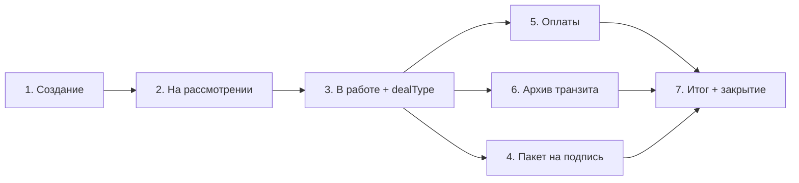

# Жизненный цикл заявки (единый эталон)

**Это главный документ по флоу заявки.** Все агенты (сервер, МП, админка, 1С) сверяются **сначала с ним**.

| Если нужно | Документ |
|------------|----------|
| Коды `statusSubType`, `docType`, `dealType` | [catalog-reference.md](catalog-reference.md) |
| HTTP-контракт upload/state | [contract-files-v2.md](contract-files-v2.md) |
| API МП / 1С | [api-app.md](api-app.md), [api-1c.md](api-1c.md) |
| Полное ТЗ | [TZ-zayavka-mp-server-1c.md](TZ-zayavka-mp-server-1c.md) |
| Краткая концепция для Cursor | `.cursor/rules/project-concept.mdc` |

**Прод:** `https://157-22-173-7.sslip.io` · **HTML:** `/docs` (вкладка ТЗ)

---

## 1. Участники

```
МП  ←—— HTTPS ——→  Сервер  ←—— Bearer ——→  1С
```

- МП **не** вызывает 1С.
- 1С **не** вызывает МП.
- Все файлы и статусы — **через сервер**.

---

## 2. Статусы верхнего уровня

| Код | В МП | Условие |
|-----|------|---------|
| `new` | Новая | Заявка на сервере, **нет** `external1cId` |
| `on_review` | На рассмотрении | Есть `external1cId`, **нет** менеджера |
| `in_progress` | В работе | В `state` пришёл менеджер |
| `in_transit` | В пути | Транзит / СВХ (по `state` от 1С) |
| `delivered` | Доставлено | Выдача клиенту, таможня пройдена |
| `closed` | Закрыта | `request_closed` |
| `cancelled` | Отменена | По бизнес-процессу |

### Переходы (кто меняет)

| Было | Стало | Кто / как |
|------|-------|-----------|
| — | `new` | МП `POST /customs-requests` |
| `new` | `on_review` | Ответ 1С на create `{ external1cId }` **или** demo после 11 upload |
| `on_review` | `in_progress` | 1С `state`: менеджер + обычно `dealType` |
| `in_progress` | `in_transit` | 1С `state` |
| `in_progress` / `in_transit` | `delivered` | 1С `state` |
| `delivered` | `closed` | 1С `state`: `request_closed` |

**Пока нет `external1cId` — заявка не «в работе»**, даже если файлы уже загружены.

---

## 3. Схема этапов (бизнес)



**Этапы 4 (подпись) и 5 (оплаты) параллельны** — квитанция утилизации может прийти **до** всех подписей.

---

## 4. Пошаговый цикл (что происходит)

### Этап 1 — Создание (МП → сервер → 1С)

| Шаг | Действие |
|-----|----------|
| 1 | МП: `POST /api/customs-requests` **без** `files[]` — поля формы + **`legalInn`** (10/12 цифр) |
|   | Заявитель = **организация входа** (ООО/ИП): наименование, ИНН, email, телефон ЮЛ — из профиля, в МП **только чтение**. |
|   | Владелец авто = **физлицо**: ФИО, телефон, СНИЛС — **вручную** на каждую заявку (не из профиля). Выбор ООО/ИП на форме создания **нет**. |
| 2 | МП: **11 обязательных** upload + опционально `add_doc1`, `add_doc2` |
| 3 | Upload: `POST /api/customs-requests/upload` — `requestId`, `docType`, `file`, `uploadIndex`, `uploadTotal` |
| 4 | На последнем upload (`uploadIndex === uploadTotal`) сервер: create в 1С, rename файлов `r{id}__` → `{external1cId}__` |
| 5 | Статус → **`on_review`**, push `request_state_update` |

**Обязательные docType при create:** см. [catalog-reference.md §1](catalog-reference.md#1-создание-заявки-мп--upload).

**Секция МП:** «Документы при подаче».

---

### Этап 2 — Менеджер и суммы (1С → сервер → МП)

| Шаг | Действие |
|-----|----------|
| 1 | 1С: `POST /api/integration/customs-requests/state` |
| 2 | Поля: `external1cId`, `status=in_progress`, `managerExternal1cId`, `managerFullName`, **`dealType`** (один раз), `advancePayment`, `actualPayment`, `statusSubType=manager_execution` |
| 3 | МП: push state, карточка — менеджер, суммы, `refundAmount` = аванс − факт (считает сервер) |

**`dealType` null** → в МП **нет** пакета на подпись.

**Справочник dealType:** [catalog-reference.md §dealType](catalog-reference.md#тип-сделки-dealtype).

---

### Этап 3 — Пакет на подпись (1С ↔ МП)

| Шаг | Кто | Действие |
|-----|-----|----------|
| 1 | 1С | Upload **оригиналов** по матрице `dealType` → [catalog-reference §2](catalog-reference.md#2-пакет-на-подпись-1с--upload-оригинал-мп--upload-_sign) |
| 2 | 1С | `state`: `statusSubType=primary_documents_sent` (или сервер выставит после upload) |
| 3 | МП | Push `request_files_update` → `GET /customs-requests/:id` |
| 4 | Клиент | Скачивает оригинал, подписывает |
| 5 | МП | Upload `docType_sign` (например `contract_sign`, `kuts_sign`) |
| 6 | Сервер | Update в 1С с изменёнными файлами |
| 7 | 1С | При браке: `state` → `signature_revision_required` → клиент перезагружает только `*_sign` |

**Правило двух файлов:** оригинал `contract` + подпись `contract_sign`. Оригинал **не** перезаписывается подписью.

**Client-only (оригинала из 1С нет):** `funds_transfer_application_sign`, `passport_notarized_copy_sign` — только upload с МП, см. таблицу в catalog-reference.

**Секция МП:** «На подпись» — **только** docType из `files[]` + матрица `dealType`, **не** все типы из enum заранее.

**Два контракта — разные `docType`:** при создании заявки — **`contract_original`** (МП → upload); в пакете на подпись — **`contract`** (1С → upload) + **`contract_sign`** (МП). В UI не смешивать секции: «Документы при создании» vs «На подпись».

---

### Этап 4 — Утилизационный сбор (1С ↔ МП, параллельно п.3)

| docType | Направление |
|---------|-------------|
| `payment_recycling_fee` | 1С → МП (скачать) |
| `payment_recycling_fee_receipt` | МП → 1С (upload) |

**Секция МП:** «Оплата».

---

### Этап 5 — Госпошлина (1С ↔ МП, параллельно п.3, часто при транзите)

| docType | Направление |
|---------|-------------|
| `payment_customs_duty` | 1С → МП |
| `payment_customs_duty_receipt` | МП → 1С |

---

### Этап 6 — Архив перед транзитом (1С → МП)

| docType | Примечание |
|---------|------------|
| `transit_archive_photo_1`, `_2`, … | Только скачивание |
| `transit_archive_video` | Только скачивание |

Статус часто → **`in_transit`**. **Секция МП:** «Архив перед транзитом».

---

### Этап 7 — Итог и закрытие (1С → МП)

| docType | Примечание |
|---------|------------|
| `epts`, `sbkts` | Только скачивание |

| Статус | Подстатус |
|--------|-----------|
| `delivered` | `issued_to_client` и др. |
| `closed` | `request_closed` |

**Секция МП:** «Итоговые документы».

---

## 5. API и push (кратко)

| Событие | Endpoint / push |
|---------|-----------------|
| Создание | `POST /customs-requests` + upload |
| Файл | `POST /customs-requests/upload` |
| Метаданные от 1С | `POST /integration/customs-requests/state` |
| Файл от 1С | тот же upload с `external1cId` |
| Карточка | `GET /customs-requests/:id` → `files[]`, суммы-строки |
| Push state | `request_update` + `previousStatus` (если сменился status) + `changeSummary` |
| Push files | `request_files_update` + `changedDocTypes` + `changeSummary` → refresh detail |
| Push chat | `new_message` |

Подробно: [contract-files-v2.md](contract-files-v2.md).

---

## 6. Секции карточки МП (фиксированный порядок)

1. Документы при подаче  
2. На подпись  
3. Оплата  
4. Архив перед транзитом  
5. Итоговые документы  

Подсветка «нужно действие» = незагруженный `*_sign` / чек + релевантный `statusSubType`.

---

## 7. Demo-прогон (без 1С)

**Триггер:** ФИО **`Тестов Тест Тестович`** (`DEMO_FLOW_ENABLED=true` на сервере).

| # | Авто | Ждёт от клиента | Статус |
|---|------|-----------------|--------|
| 0 | 11 upload → `on_review`, `DEMO-1C-{id}` | 11 файлов create | `on_review` |
| 1 | Менеджер, суммы, чат | — | `in_progress` |
| 2 | Upload **`contract` + `kuts`** (2 оригинала) | — | `primary_documents_sent` |
| 3 | — | `contract_sign`, `kuts_sign` | ждёт |
| 4 | Квитанция утилизации | — | — |
| 5 | — | `payment_recycling_fee_receipt` | ждёт |
| 6 | Транзит + архив | — | `in_transit` |
| 7 | Госпошлина | — | — |
| 8 | — | `payment_customs_duty_receipt` | ждёт |
| 9 | `epts`, `sbkts` | — | `delivered` |
| 10 | Закрытие | — | `closed` |

- **Чат:** сообщение клиента → автоответ менеджера (~4 с).  
- **Сброс:** `/admin/` → «Удалить последнюю demo-заявку».  
- Код: `import_service_server/src/services/demoFlow.js`.

Demo **не** шлёт лишние docType на подпись и **ждёт** upload клиента между шагами.

---

## 8. Контракт API (кратко)

| Канал | Назначение |
|-------|------------|
| `upload` | Все файлы (1С и МП) |
| `state` | Метаданные: статус, менеджер, суммы, авто |
| `GET :id` | Карточка с `files[]` для МП |

Подробно: [contract-files-v2.md](contract-files-v2.md).

---

## 9. При расхождении

1. **Этот файл** (`request-lifecycle.md`)  
2. [catalog-reference.md](catalog-reference.md)  
3. [contract-files-v2.md](contract-files-v2.md)  
4. `.cursor/rules/project-concept.mdc`  
5. [TZ-zayavka-mp-server-1c.md](TZ-zayavka-mp-server-1c.md)  
6. HTML `/docs`

**Не плодить** отдельные one-off промпты и сценарии — правки сюда или в catalog-reference / contract-files-v2.
